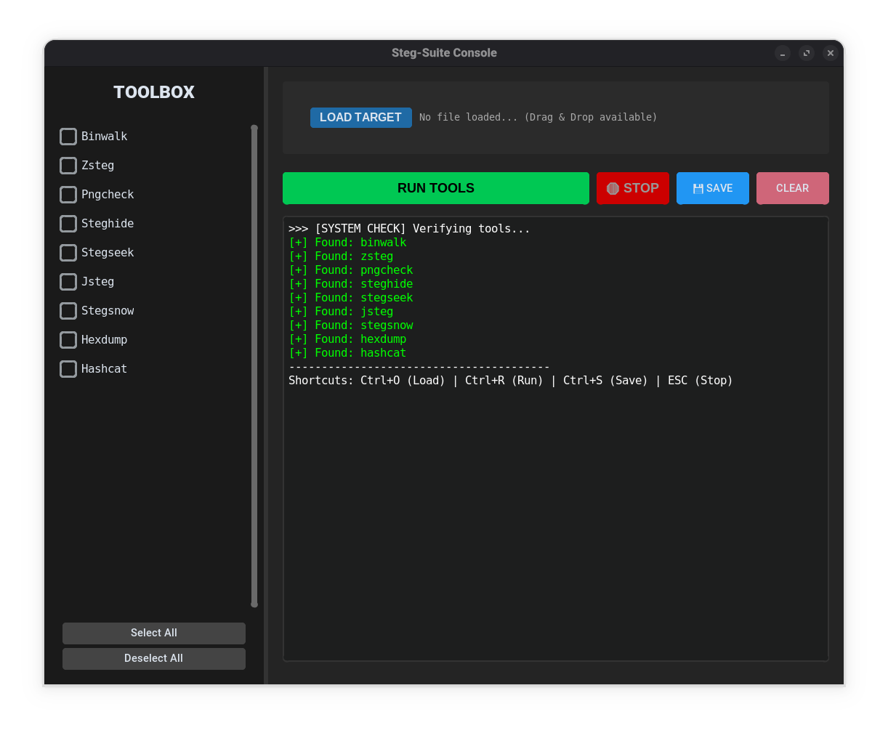

# Steg-Suite Console 🕵️‍♂️🔓

**Steg-Suite Console** is a unified, cross-platform GUI designed to make complex command-line steganography tools accessible and easy to chain together.

Instead of memorizing dozens of flags for `zsteg`, `binwalk`, or `steghide`, this tool lets you simply speedrun through your CTF challenges (stego). Drag, drop, check the boxes, and let the suite handle the syntax.




---

## 🤖 About "Vibe Coding"
This project was **"Vibe Coded"** with the assistance of AI (Gemini). The goal was to take powerful but fragmented CLI tools and wrap them in a simplified, modern interface without over-engineering the solution. It focuses on flow, speed, and utility. Just want to help anyone if i can

---

---

# ❤️ Acknowledgments & Credits

**Steg-Suite Console** is a wrapper built on the shoulders of giants. This project would not exist without the incredible work of the security researchers and developers who created these core tools and open-sourced them for the world to use.

A massive **THANK YOU** to these creators for their dedication to the open-source community.

---

## ✨ Key Features

* **🛠️ All-in-One Toolbox:** Wraps `Binwalk`, `Zsteg`, `Steghide`, `Stegseek`, `ExifTool`, `Pngcheck`, `Jsteg`, `Stegsnow`, `Hashcat`, and `Hexdump`.
* **⛓️ Chain Attacks:** Select multiple tools and run them sequentially.
* **🖱️ Drag & Drop:** Load files instantly without typing paths.
* **🖥️ Cross-Platform:**
    * **Linux:** Full support.
    * **Windows:** (Experimental) Includes path configuration for `.exe` tools and a pure-Python fallback for `hexdump`.
* **⚙️ Smart Configuration:** Define custom paths for your tools via `config_application.txt`.
* **🧠 Intelligent Output:** Filters noise (like empty Zsteg lines) so you only see the flag/data.
* **🛑 Control:** Stop hanging processes instantly and save your logs.

---

## ⚠️ Disclaimer: Windows Support
Support for **Windows is currently experimental**. While the code handles `.exe` paths and platform-specific commands, steganography tools are natively designed for Linux. You may encounter bugs or setup hurdles on Windows.

---

## 🛠️ Core Tools & Installation

We rely on these incredible open-source tools. Please support the original creators!

| Tool | Description | Download / Source Link |
| :--- | :--- | :--- |
| **Binwalk** | Firmware analysis and extraction tool. | [**GitHub Repository**](https://github.com/ReFirmLabs/binwalk) |
| **Steghide** | Hides data in various audio and image files. | [**SourceForge Page**](http://steghide.sourceforge.net/) |
| **Stegseek** | The world's fastest Steghide cracker. | [**View Release v0.6**](https://github.com/RickdeJager/stegseek/releases/tag/v0.6) |
| **ExifTool** | Reading, writing and manipulating image metadata. | [**Official Website**](https://exiftool.org/) |
| **Pngcheck** | Verifies the integrity of PNG files. | [**Official Website**](http://www.libpng.org/pub/png/apps/pngcheck.html) |
| **Jsteg** | JPEG steganography tool. | [**View Releases**](https://github.com/lukechampine/jsteg/releases) |
| **Stegsnow** | Hides messages in text files by appending whitespace. | [**Darkside Website**](http://www.darkside.com.au/snow/) |
| **Hashcat** | The world's fastest password cracker. | [**View Release v7.1.2**](https://github.com/hashcat/hashcat/releases/tag/v7.1.2) |
| **Zsteg** | Essential PNG/BMP analysis tool. | *See installation commands below* |

Note: Steg-Suite is not a standalone tool it needs these to work

### 💎 Zsteg Setup
Since **Zsteg** is a Ruby gem, it requires a manual installation step:

```bash
# Install Ruby Dependencies
sudo apt install ruby ruby-dev -y

# Install Zsteg
sudo gem install zsteg
```

### 1. Installation
```bash
# Clone the repo
git clone https://github.com/Photon6000/Steg-Suite.git
cd Steg-Suite

# Install Python GUI libraries
pip install customtkinter tkinterdnd2
```
or just 
``` install the .deb for debian and ubuntu users```
